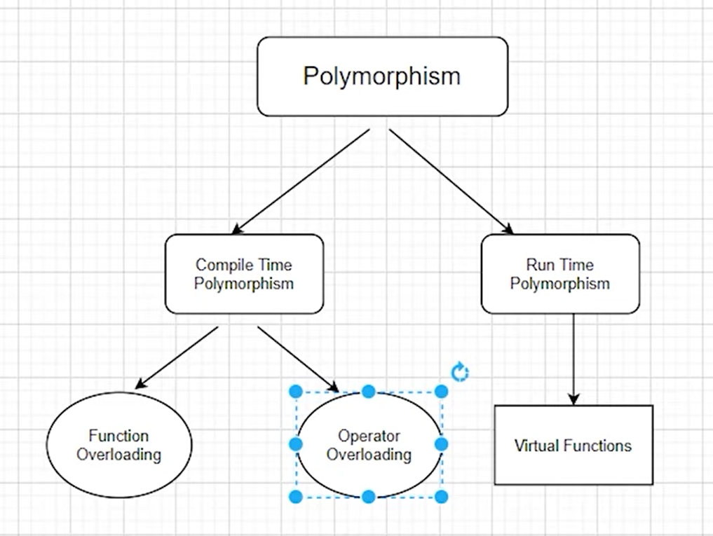

# Object Oriented Programming C++ Notes

## Visibility in Inheritance

Members\Visibility | Private | Public | Protected
--- |--- |--- |---
Private members | Not Inherited | Not Inherited | Not Inherited 
Public members | Private | Public | Protected
Protected members | Private | Protected | Protected

Private members of the class cannot be directly inherited in the derived class instead to access the private members of the base class we need to create the public getter and setter methods.

---

## Ambiguity in Multiple Inheritance

When all the base class have the same member or function names then the derived class doesn't know whose which base class member or function to access. This is Ambiguity.

Ways to resolve Ambiguity:
- If it is a function, override it in the derived class.
- If it is a function, create a same function in derived class and specify which base function to call. Syntax: ```BaseA :: greet();``` This will call the BaseA greet function.

## Virtual Base Class

    Hybrid Inheritance

                    Class A
                _______|______
                |             |
             Class B        Class C
                |_____________|
                       |
                     Class D


```cpp
class A{
    public:
    int var;
};

class B: public A{
    // code
};

class C: public A{
    // code
};

class D: public B, public C{
    public:
    void getVar(){
        cout<<var<<endl;
    }
};
```

In the above example, the var will be inherited twice in class D, one from class B and other from class C. To avoid this Ambiguity use virtual keyword while deriving the class D;

```cpp
class A{
    public:
    int var;
};

class B: virtual public A{
    // code
};

class C: virtual public A{
    // code
};

class D: public B, public C{
    public:
    void getVar(){
        cout<<var<<endl;
    }
};
```

Class A is now called as virtual base class.
For a good practise try to avoid multiple inheritance and use abstract class instead.


## Constructor call in Inheritance

- If there are one or more arguments in the base class constructor, derived class need to pass arguments to the base class constructor.
- If both base class and derived classes have constructors, base class constructor is executed first.
- In multiple inheritance, base classes are constructed in the order in which they appear in the class declaration. ```class C: A, B``` Class A constructor is called first the B's and the C's.
- In multilevel inheritance, the constructors are executed in the order of inheritance.

### Passing arguments to multiple base class constructors

Syntax: ```Class C(a1, a2, a3, a4, a5, a6): A(a3, a4), B(a5, a6) {}```

### Special case of virtual base class

- The constructors for virtual base classes are invoked before an nonvirtual base class.
- If there are multiple virtual base classes, they are invoked in the order declared.
- Any non-virtual base class are then constructed before the derived class constructor is executed.
- ```class A: public B, virtual public C``` Order of execution of constructor -> C() then B() then A().
- Virtual Base class constructor will always be executed first, let it be any hierarchy.


## Polymorphism



